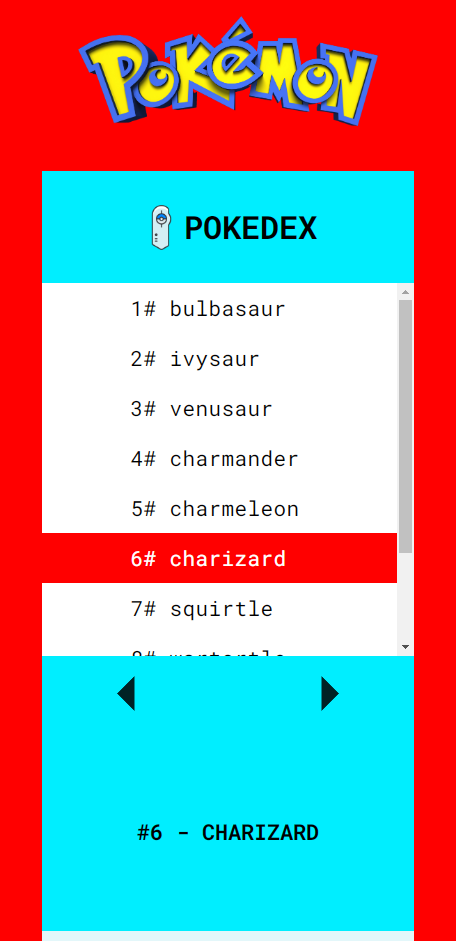
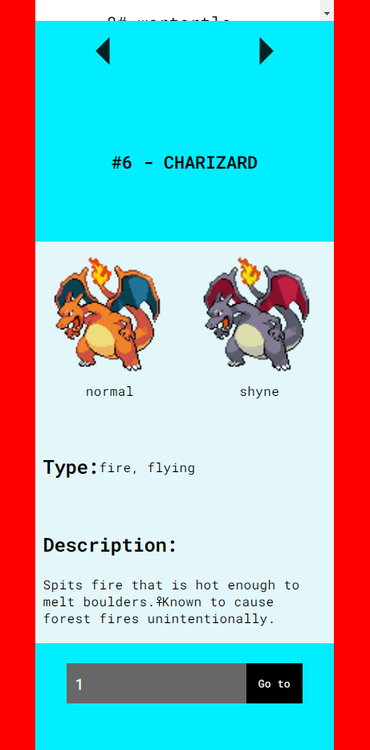

# Pokedex---com-ReactJS
Pokedex para web com React js e Sass

     

## SUMÁRIO

- Status
- Features
- Demonstração da Aplicação
- Como Rodar a Aplicação
- Tecnologias utilizadas
- Autor

## Status

✨Concluído ✨

## Features

- Aplicação responsiva;
- Lista com nome de 10 pokemons;
- Botôes para navegar entre as páginas com listas de pokemons diferentes;
- Exibe informações, como decrição, tipo e imagens dos pokemons;
- Cor diferente na lista para o pokemon em exibição;
- Input para buscar o pokemon pelo número na pokedex.

## Demonstração da Aplicação

### Pokedex Desktop

### Pokedex mobile - 1

### Pokedex mobile - 2

## Pré Requisitos Para rodar a aplicação
- Instalar o NodeJs.

## Como Rodar a Aplicação
Pelo promt de comando entre na pasta do projeto, em seguida rode o comando npm install (para instalar as dependências), e por fim, rode o compando npm start (para que o projeto seja iniciado no navegador).

## Tecnologias Utilizadas

- [html](https://developer.mozilla.org/pt-BR/docs/Web/HTML)
- [css](https://developer.mozilla.org/pt-BR/docs/Web/CSS)
- [sass](https://sass-lang.com/documentation)
- [javscript](https://developer.mozilla.org/pt-BR/docs/Web/JavaScript)
- [ReactJS](https://pt-br.reactjs.org/)
- [npm](https://docs.npmjs.com/)
- [Pokeapi](https://pokeapi.co/)

## Autor

Feito por Vitor Mateus

 
